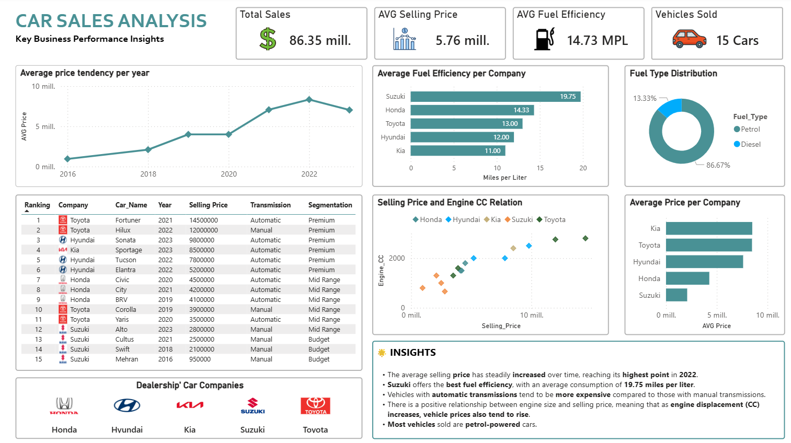

# SQL Car Sales Business Analysis

## Overview
This project focuses on automotive sales analysis using SQL to answer business questions and generate strategic insights from vehicle sales data.

The analysis simulates a real-world business scenario where data is used to support decision-making, identify market trends, and evaluate vehicle performance.

---

## Business Context

### Fictional Company

DriveIQ Motors is a company that operates a network of used-car dealerships across Latin America.

The company collects information related to:

- Vehicle brand
- Model
- Year
- Selling price
- Fuel type
- Transmission type
- Fuel efficiency
- Engine size

The executive team aims to leverage data to:

- Identify which brands generate the highest value
- Detect market trends
- Optimize inventory decisions
- Understand which vehicle characteristics increase prices

As a Business Intelligence Analyst, the objective of this project is to transform raw data into actionable business insights using SQL and Power BI.

---

## Dataset

Original dataset obtained from Kaggle:

- [Car Sales Analysis Dataset - Kaggle](https://www.kaggle.com/datasets/jawadaahmed/car-sales-analysis-dataset?utm_source=chatgpt.com)

---

## Dataset Structure

| Column | Description |
|---|---|
| Car_Name | Vehicle model |
| Company | Manufacturer brand |
| Year | Vehicle year |
| Selling_Price | Vehicle selling price |
| Fuel_Type | Fuel type |
| Transmission | Transmission type |
| Mileage | Fuel efficiency |
| Engine_CC | Engine displacement |

## Objectives
- Practice SQL in real-world business scenarios
- Perform exploratory data analysis
- Solve business-related questions
- Practice data visualization
- Build a professional portfolio project

---

## Business Questions
- Which brands generate the highest average selling price?
- Which fuel type dominates the market?
- Are automatic vehicles more expensive?
- Is there a relationship between engine size and vehicle price?
- Which models offer the best fuel efficiency?
- What is the average vehicle value by year?
- Which brands provide the best average fuel efficiency?
- Price segmentation
- Most expensive vehicles
- Which fuel type and transmission combination is the most common?

---

## Tools & Technologies
- SQL
- MySQL
- Power BI
---

## Demonstrated Skills
- Aggregations
- Window Functions
- CASE Statements
- Views
- Business Analysis
- Data Storytelling

---
## Example SQL Query

```sql
-- Most expensive vehicles
SELECT company, car_name, selling_price, transmission, engine_CC,
RANK() OVER(ORDER BY selling_price DESC) as TOP_5
FROM car_sales
LIMIT 5;
```
---

## Dashboard Preview



---

## Key Insights

- Average selling prices increased consistently over time.
- Automatic vehicles tend to have higher selling prices.
- Suzuki provides the best average fuel efficiency.
- Petrol-powered vehicles dominate the market.
- Engine size positively correlates with selling price.

## Project Structure

```text
car-sales-sql-analysis/
│
├── datasets/
│   └── car_sales_analysis_dataset.csv
│
├── sql/
│   ├── database_setup.sql
│   ├── business_questions.sql
│   ├── views.sql
│   └── advanced_analysis.sql
│
├── dashboard/
│   └── car_sales_dashboard.pbix
│
├── images/
│   └── dashboard.png
│
└── README.md
```
